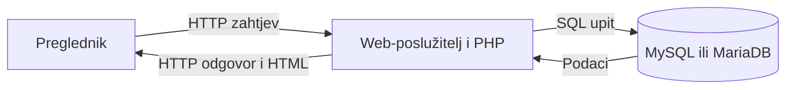
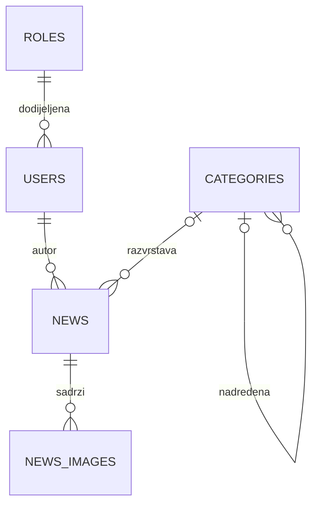

# PHP programiranje: upute za razvoj projektnog zadatka

Razvijte funkcionalnu web-aplikaciju koja povezuje **HTML5, CSS, PHP i relacijsku bazu podataka**. Aplikacija treba imati javni dio za posjetitelje i zaštićeni administracijski dio za upravljanje sadržajem, odnosno **CMS** (*Content Management System*).

Polazni primjer je aplikacija za objavu novosti i članaka. Temu možete prilagoditi vlastitim interesima: studentski portal, sportski klub, turistička zajednica, kulturna udruga, lokalni medij ili predstavljanje tvrtke. Odabrana tema treba imati smislen sadržaj i omogućiti provjeru funkcionalnosti opisanih u ovim uputama.

Upute slijede smjer nastavne prezentacije **PHP programiranje** i razrađuju razvoj konkretnog APP-a s novostima i CMS-om. Prezentacija dopušta prilagodbu naziva i namjene stranica, uz najmanje pet različitih stranica. Ovdje je opisana referentna izvedba projekta i način provjere njezina rada.

**Oznake u dokumentu:**

- **Obvezno**: funkcionalnosti i zahtjevi osnovne izvedbe opisane ovim uputama.
- **Preporučeno**: postupci koji olakšavaju razvoj, korištenje i održavanje.
- **Nadogradnja**: dodatne mogućnosti koje možete razviti nakon dovršetka osnovne izvedbe. Potkategorije, više CMS uloga i galerija unutar članka pripadaju ovoj skupini.

## Sadržaj

1. [Cilj i ishodi projekta](#cilj)
2. [Planiranje prije pisanja koda](#planiranje)
3. [Tehnologije i razvojno okruženje](#okruzenje)
4. [Obvezni opseg projekta](#opseg)
5. [Javni dio aplikacije](#javni-dio)
6. [Administracija i CMS](#cms)
7. [Model baze podataka](#baza)
8. [Organizacija koda i obrada zahtjeva](#kod)
9. [Sigurnost i provjera podataka](#sigurnost)
10. [Preporučene faze razvoja](#faze)
11. [Mogućnosti nadogradnje](#nadogradnje)
12. [Testiranje aplikacije](#testiranje)
13. [GitHub repozitorij i predaja](#predaja)
14. [Predstavljanje i procjena projekta](#procjena)
15. [Završna kontrolna lista](#kontrolna-lista)
16. [Dokumentacija za rad](#dokumentacija)

<a id="cilj"></a>

## 1. Cilj i ishodi projekta

Projektom trebate pokazati da možete samostalno osmisliti, izraditi, pokrenuti i objasniti web-aplikaciju. Završna aplikacija mora čitati podatke iz baze i omogućiti njihovo uređivanje kroz zaštićeno sučelje.

Nakon izrade projekta trebate moći:

- objasniti razliku između koda koji se izvršava u pregledniku i koda koji se izvršava na poslužitelju;
- pripremiti lokalni web-poslužitelj i bazu podataka;
- oblikovati responzivno sučelje primjenom HTML-a i CSS-a;
- obraditi `GET` i `POST` zahtjeve u PHP-u;
- modelirati tablice, njihove ključeve i međusobne veze;
- implementirati CRUD operacije: unos, pregled, izmjenu i brisanje podataka;
- razlikovati prijavu korisnika od provjere njegovih ovlasti;
- provjeriti podatke iz obrazaca i sigurno ih prikazati;
- koristiti Git i GitHub za praćenje razvoja;
- dokumentirati instalaciju, testirati rad i predstaviti vlastito rješenje.

Osnovni tok rada aplikacije:



Preglednik šalje zahtjev, PHP obrađuje podatke i po potrebi pristupa bazi, a poslužitelj vraća odgovor koji preglednik prikazuje korisniku.

<a id="planiranje"></a>

## 2. Planiranje prije pisanja koda

Prije implementacije napišite kratak opis projekta. Spremite ga u `README.md` ili u zaseban dokument unutar mape `docs/`.

Opis treba sadržavati:

| Stavka | Što trebate navesti |
| --- | --- |
| Naziv projekta | Kratak naziv koji odgovara temi aplikacije. |
| Svrha | Koji problem aplikacija rješava ili koji sadržaj predstavlja. |
| Ciljani korisnici | Tko pregledava javni dio i tko uređuje sadržaj. |
| Stranice i prikazi | Popis stranica te način kretanja između njih. |
| Osnovne funkcionalnosti | Što će raditi u prvoj dovršenoj verziji. |
| Podaci | Koje podatke spremate i kako su povezani. |
| Ovlasti | Tko smije pregledavati, dodavati, uređivati i brisati podatke. |
| Nadogradnje | Koje dodatne mogućnosti planirate ako dovršite osnovni opseg. |
| Plan provjere | Kako ćete pokazati da svaka funkcionalnost radi. |

Pripremite jednostavne skice početne stranice, popisa novosti, detalja članka i CMS-a. Skica može biti nacrtana na papiru ili izrađena digitalno. Važno je unaprijed odrediti položaj navigacije, sadržaja, obrazaca i glavnih akcija.

**Primjer opisa:** „Aplikacija predstavlja studentsku udrugu. Posjetitelji pregledavaju novosti i šalju upite. Ovlašteni korisnik kroz CMS objavljuje članke, dodaje naslovne slike i arhivira stare objave. Kao nadogradnju planiram kategorije i galeriju fotografija uz svaki članak.”

<a id="okruzenje"></a>

## 3. Tehnologije i razvojno okruženje

### 3.1. Tehnologije

| Tehnologija ili alat | Namjena |
| --- | --- |
| HTML5 | Struktura sadržaja i obrazaca. |
| CSS | Izgled, raspored elemenata i prilagodba zaslonima. |
| PHP | Obrada zahtjeva, prijava, rad s bazom i generiranje stranica. |
| MySQL ili MariaDB | Trajna pohrana podataka. |
| Apache i XAMPP | Lokalno razvojno okruženje u skladu s nastavnim primjerima. |
| phpMyAdmin ili drugi alat za bazu | Izrada, pregled, uvoz i izvoz baze. |
| Git i GitHub | Verzije izvornog koda i dokumentacija projekta. |
| JavaScript, po potrebi | Poboljšanja korisničkog sučelja, primjerice pregled slike prije prijenosa. |

Zabilježite korištene verzije PHP-a i baze u `README.md`. Navedite potrebna PHP proširenja, primjerice `mysqli` ili `pdo_mysql`, te proširenja koja koristi odabrana obrada slika i HTML-a.

Možete koristiti pomoćne biblioteke ako navedete njihovu namjenu i način instalacije. Vlastita implementacija treba pokazati razumijevanje PHP-a, baze, obrazaca i upravljanja pristupom.

### 3.2. Lokalno pokretanje

1. Pripremite XAMPP ili odgovarajuće nastavno okruženje.
2. Pokrenite web-poslužitelj i servis baze podataka.
3. Smjestite projekt u mapu koju poslužitelj poslužuje. U uobičajenoj Windows instalaciji XAMPP-a to je `C:\xampp\htdocs\naziv-projekta`.
4. Izradite bazu i uvezite SQL datoteke projekta.
5. U lokalnu konfiguraciju upišite naziv baze, adresu poslužitelja i pristupne podatke.
6. Provjerite dozvole mape u koju aplikacija sprema slike.
7. Otvorite aplikaciju preko adrese poput `http://localhost/naziv-projekta/`.
8. Provjerite početnu stranicu, pristup bazi i prijavu testnog korisnika.

PHP stranicu otvarajte preko web-poslužitelja. Otvaranje datoteke putem `file://` ne izvršava PHP kod.

**GitHub repozitorij služi za predaju koda.** Za javno pokretanje aplikacije potreban je poslužitelj s PHP-om i bazom. GitHub Pages poslužuje statične stranice i ne izvršava PHP na poslužitelju. Izvor: [GitHub Pages dokumentacija](https://docs.github.com/en/pages/getting-started-with-github-pages/what-is-github-pages).

<a id="opseg"></a>

## 4. Obvezni opseg projekta

### 4.1. Minimalna funkcionalna cjelina

| Područje | Što osnovna izvedba treba sadržavati |
| --- | --- |
| Javni sadržaj | Najmanje pet različitih, smislenih stranica ili funkcionalnih prikaza. |
| Navigacija | Povezane stranice i dosljedan glavni izbornik. |
| Novosti | Popis iz baze, sažetak do tri retka i otvaranje cijelog članka. |
| Članak | Naslov, datum, slika, formatirani sadržaj i povratak na popis. |
| Kontakt | Karta, obrazac i stvarna obrada poslanog upita. |
| Multimedija | Tematski povezane slike i najmanje jedan videozapis u aplikaciji. |
| Korisnici | Registracija, prijava, odjava i kontrola pristupa CMS-u. |
| CMS | Upravljanje novostima i korisničkim računima u okviru dodijeljenih ovlasti. |
| Baza | Trajna pohrana članaka i korisnika, uz dokumentiran model. |
| Sigurnost | Provjera ulaza, pripremljeni SQL upiti, zaštita sesije, HTML-a i obrazaca. |
| GitHub | Izvorni kod, dokumentacija, struktura baze i podaci za demonstraciju. |

Za referentnu aplikaciju sadržajni prikazi su **Početna**, **Novosti**, **Članak**, **O nama** i **Kontakt**. Registracija, prijava i CMS dodatni su prikazi. Ako odaberete drugu temu, u dokumentaciji pokažite kako njezine stranice pokrivaju iste funkcionalnosti.

Stranice se mogu generirati kroz jedan ulazni `index.php` i različite parametre. Nije potrebno imati pet fizičkih `.html` datoteka. Više članaka prikazanih istim predloškom predstavlja jedan tip prikaza članka.

### 4.2. Zajednički elementi stranica

Svaka generirana stranica treba imati:

- HTML5 deklaraciju `<!DOCTYPE html>`;
- `<html lang="hr">` ili jezičnu oznaku koja odgovara sadržaju;
- `<head>`, UTF-8 kodiranje, smislen `<title>` i metapodatak za responzivan prikaz;
- poveznicu na CSS i favicon;
- `<body>`, zaglavlje `<header>`, navigaciju `<nav>`, glavni sadržaj `<main>` i podnožje `<footer>`;
- dosljedne naslove, tipografiju, razmake i boje;
- vidljiv način povratka ili nastavka kretanja kroz aplikaciju.

Glavni izbornik oblikujte pomoću `<nav>`, `<ul>`, `<li>` i poveznica. Aktivnu stavku izbornika vizualno označite.

Na javnim stranicama koristite sliku povezanu sa sadržajem i odgovarajući opis. Na sadržajnim stranicama to može biti fotografija s opisom, a na stranicama obrazaca tematsko zaglavlje. Za informativne slike napišite smislen `alt`, a uz fotografije kojima je potreban vidljiv opis koristite `<figure>` i `<figcaption>`.

### 4.3. Responzivnost i pristupačnost

Raspored mora ostati upotrebljiv na računalu i mobitelu. Provjerite barem jednu usku širinu, primjerice 390 px, i jednu široku, primjerice 1440 px. To su preporučene testne širine, a dizajn treba raditi i između njih.

Obvezno provjerite da:

- sadržaj stranice ne izlazi izvan širine zaslona;
- slike zadržavaju omjer stranica;
- dugački naslovi i poveznice ne razbijaju raspored;
- obrasci imaju povezane elemente `<label>` i jasne poruke;
- korisnik može koristiti poveznice i gumbe tipkovnicom te vidjeti fokus;
- tekst ostaje čitljiv i pri povećanju prikaza;
- pogreške nisu označene samo bojom.

<a id="javni-dio"></a>

## 5. Javni dio aplikacije

### 5.1. Početna stranica

Početna stranica treba objasniti temu i svrhu aplikacije te usmjeriti posjetitelja prema sadržaju.

**Obvezno:**

- najmanje jedan glavni naslov;
- najmanje tri smislena odlomka;
- najmanje jedna slika s pripadajućim tekstom;
- poveznice ili ikone koje vode na odgovarajuće društvene mreže;
- pristup drugim javnim stranicama preko glavne navigacije.

**Preporučeno:** prikažite nekoliko najnovijih objava iz baze, s poveznicama na članke. Koristite stvarne ili jasno označene demonstracijske sadržaje, uz navedene izvore fotografija i preuzetih tekstova.

### 5.2. Popis novosti

Novosti se moraju dohvaćati iz baze. Za demonstraciju pripremite **najmanje tri objavljene novosti**, u skladu s prezentacijom.

Svaka stavka popisa treba prikazati:

| Element | Očekivano ponašanje |
| --- | --- |
| Naslov | Jasno vidljiv, s poveznicom na članak. |
| Slika | Naslovna slika novosti ili uredan prikaz kada slika nije dostupna. |
| Sažetak | Čist tekst bez HTML oznaka, prikazan u najviše tri retka. |
| Datum | Čitljiv datum objave. |
| Poveznica „Više” | Otvara cijeli članak i postoji i za kratke novosti. |

Novosti poredajte od najnovije prema najstarijoj. Ako dvije novosti imaju jednak datum, dodatno ih poredajte po ID-u kako bi redoslijed bio predvidljiv.

U javnom popisu prikazujte samo objavljene, nearhivirane novosti. Kada nema podataka, prikažite poruku poput „Trenutačno nema objavljenih novosti.”

**Tri retka nisu jednakovrijedna određenom broju znakova.** Na širokom zaslonu u redak stane više teksta nego na mobitelu. Zato ograničenje vidljivih redaka provedite CSS-om, dok PHP priprema čist tekst sažetka.

Primjer CSS-a:

```css
.news-excerpt {
    display: -webkit-box;
    -webkit-box-orient: vertical;
    -webkit-line-clamp: 3;
    line-clamp: 3;
    line-height: 1.5;
    max-height: 4.5em;
    overflow: hidden;
    overflow-wrap: anywhere;
}
```

Poveznicu „Više” i datum postavite izvan elementa koji se skraćuje kako bi uvijek ostali dostupni. Podršku i prikaz provjerite u preglednicima koje koristite. Dokumentacija: [MDN: line-clamp](https://developer.mozilla.org/en-US/docs/Web/CSS/Reference/Properties/line-clamp).

### 5.3. Prikaz pojedinog članka

Klik na naslov ili „Više” treba otvoriti članak prema njegovu ID-u, primjerice preko `index.php?menu=2&action=33`.

**Obvezno:**

- prikaz naslova, datuma, naslovne slike i cijelog sadržaja;
- pravilno oblikovanje odlomaka, podnaslova, popisa, citata i naglašenog teksta;
- vidljiv gumb ili poveznica **„Povratak na novosti”**;
- provjera da ID postoji i da članak smije biti javno prikazan;
- poruka i status HTTP 404 za nepostojeći ili javno nedostupan članak.

Povratak neka vodi na poznatu adresu popisa. Mora raditi i kada posjetitelj članak otvori izravnom poveznicom. Kod duljih članaka preporučuje se povratak na vrhu i na dnu.

HTML sadržaj prikažite unutar prikladnog spremnika, primjerice `<div class="news-body">`. Cijeli članak koji već sadrži `<p>`, `<h2>` i druge blokove nemojte dodatno omotati jednim elementom `<p>`.

#### Razlika između sadržaja članka i sažetka

| Prikaz | Obrada sadržaja |
| --- | --- |
| Cijeli članak | Dopušteno HTML oblikovanje nakon sigurnosnog filtriranja. |
| Sažetak | Tekst bez HTML oznaka, uz sačuvane razmake između odlomaka. |
| Polje za uređivanje | Izvorni sadržaj prikazan kao vrijednost obrasca, sigurno kodiran za taj kontekst. |

Ako nastavite razvijati postojeći projekt, provjerite sadrži li baza stvarne oznake poput `<p>` ili HTML entitete poput `&lt;p&gt;`. Za postojeće kodirane zapise dekodiranje je korak pripreme sadržaja, a potom slijedi filtriranje dopuštenog HTML-a. Nemojte dekodirati sadržaj opetovano pri svakom otvaranju i spremanju.

Samo `html_entity_decode()` nije zaštita od zlonamjernog sadržaja. Funkcija pretvara HTML entitete u znakove. Izvor: [PHP: html_entity_decode](https://www.php.net/manual/en/function.html-entity-decode.php). Pravila filtriranja nalaze se u [poglavlju o sigurnosti](#sigurnost).

### 5.4. O nama

Stranica treba sadržavati najmanje:

- jedan glavni naslov i jedan podnaslov;
- tri odlomka o temi, organizaciji ili svrsi projekta;
- tematski povezanu sliku;
- videozapis ugrađen s YouTubea ili vlastiti video putem HTML elementa `<video>`.

Video prilagodite širini sadržaja. Ugrađenom okviru dodajte opisni `title`, a vlastitom videu kontrole reprodukcije. Ako video smjestite na drugu smislenu stranicu projekta, navedite gdje se nalazi.

### 5.5. Kontakt

Kontaktna stranica treba imati naslov, podatke za kontakt, interaktivnu Google kartu i obrazac koji se obrađuje na poslužitelju.

| Polje | Provjera i očekivanje |
| --- | --- |
| Ime | Obvezan tekst, bez praznog unosa koji sadrži samo razmake. |
| Prezime | Obvezan tekst uz razumno ograničenje duljine. |
| E-mail | Obvezna adresa provjerena u PHP-u. |
| Država | Odabir iz unaprijed definiranog skupa država. |
| Newsletter | Prikazana mogućnost odabira „Da” ili „Ne”. Odgovor „Ne” mora dopuštati slanje kontaktnog upita. |
| Tijelo poruke | Obvezan sadržaj uz definiranu maksimalnu duljinu. |

Polje newslettera iz prezentacije predstavlja izbor korisnika. Možete koristiti izričit odabir „Da/Ne” ili kućicu čija neoznačena vrijednost znači „Ne”. Samo bilježenje tog izbora ne zahtijeva izradu sustava za slanje newslettera.

Obrazac mora imati stvaran ishod: **spremanje upita u bazu ili slanje kroz konfigurirani sustav za e-poštu**. U dokumentaciji navedite odabranu izvedbu. Ako upite spremate, omogućite ovlaštenom korisniku njihov pregled. Za e-poštu dokumentirajte način lokalnog testiranja bez javne objave pristupnih podataka.

Potvrdu prikažite tek nakon uspješne obrade. Kod pogreške objasnite što korisnik treba ispraviti i sačuvajte već unesene podatke gdje je to prikladno.

### 5.6. Registracija

Obrazac za registraciju treba sadržavati ime, prezime, e-mail, korisničko ime i lozinku. Preporučeno je dodati potvrdu lozinke.

Poslužitelj mora provjeriti obvezna polja, format e-maila, duljine vrijednosti te zauzetost korisničkog imena i e-maila. Pravila za lozinku jasno prikažite uz obrazac i provedite ih u PHP-u. Za demonstraciju nemojte koristiti stvarne osobne podatke.

Novi račun ne smije registracijom sam sebi dodijeliti pristup CMS-u. Dokumentirajte treba li račun aktivirati i tko dodjeljuje ovlast za administraciju.

### 5.7. Prijava i odjava

Prijava traži **korisničko ime ili e-mail te lozinku**. Ime i prezime pripadaju registraciji, a ne ponovnom unosu pri svakoj prijavi.

Pri prijavi provjerite podatke, status računa i lozinku. Nakon uspjeha uspostavite sesiju i promijenite njezin identifikator. Kod neuspjeha prikažite opću poruku, primjerice „Neispravni podaci za prijavu.”

Odjava mora ukloniti podatke prijavljene sesije i onemogućiti daljnje administrativne radnje. Nakon odjave ponovnim otvaranjem CMS adrese mora se ponovno tražiti prijava.

<a id="cms"></a>

## 6. Administracija i CMS

### 6.1. Pristup administraciji

**Obvezno je razlikovati javnog posjetitelja od korisnika ovlaštenog za CMS.** Provjeru provedite na poslužitelju za svaki zaštićeni prikaz i svaku radnju.

U osnovnoj verziji dovoljan je jedan skup CMS ovlasti. Možete ga predstavljati poljem poput `can_access_cms`. Aktivnost računa i pravo pristupa administraciji odvojene su odluke. Razrada više uloga, kao što su administrator, urednik i autor, izborna je nadogradnja.

Prvog ovlaštenog korisnika pripremite dokumentiranim postupkom, primjerice lokalnom instalacijskom skriptom ili kontroliranim unosom u bazu. Posjetitelj ne smije dobiti te ovlasti izmjenom registracijskog obrasca ili URL-a.

### 6.2. Upravljanje novostima

CMS treba podržavati cijeli CRUD ciklus:

| Operacija | Očekivano ponašanje |
| --- | --- |
| Create: dodavanje | Unos naslova, sadržaja, slike i stanja objave. |
| Read: pregled | Popis zapisa i pregled pojedine novosti, uključujući arhivirane. |
| Update: izmjena | Učitavanje postojećih vrijednosti, njihova provjera i spremanje promjena. |
| Delete: brisanje | Jasno označena radnja, potvrda korisnika i sigurno uklanjanje zapisa. |

Uz CRUD omogućite **arhiviranje i ponovno objavljivanje**. Arhiviranje zadržava zapis u bazi, dok ga javni dio više ne prikazuje. Brisanje trajno uklanja zapis prema pravilima projekta.

Obrazac treba podržati uređivanje članka bez obveznog ponovnog prijenosa slike. Ako korisnik ne odabere novu sliku, postojeća slika ostaje vezana uz članak. Ako odabere nevaljanu datoteku, aplikacija treba prikazati pogrešku i sačuvati uneseni tekst.

Nakon uspješnog spremanja prikažite poruku i preusmjerite korisnika na prikladan prikaz. Osvježavanje te stranice ne smije ponovno dodati isti zapis.

### 6.3. Upravljanje korisničkim računima

Ovlašteni korisnik CMS-a treba moći pregledati korisnike, urediti osnovne podatke i aktivirati ili deaktivirati račun. U osnovnoj izvedbi s jednim skupom administrativnih ovlasti taj korisnik upravlja i pristupom CMS-u.

Lozinke i njihovi hash zapisi ne smiju biti vidljivi u popisu korisnika niti unaprijed popunjeni u obrascu. Promjena lozinke, ako je implementirate, zasebna je radnja.

Za uklanjanje korisnika koji ima povezane članke definirajte pravilo: onemogućiti brisanje, prenijeti autorstvo ili deaktivirati račun. Sačuvajte mogućnost upravljanja aplikacijom tako da se ne može ukloniti posljednji aktivni korisnik s administrativnim ovlastima.

<a id="baza"></a>

## 7. Model baze podataka

Prije implementacije izradite ER dijagram i popis tablica. Svaka tablica treba imati primarni ključ, odgovarajuće tipove podataka i jasno definiranu svrhu. Koristite `utf8mb4` u bazi i vezi prema bazi radi hrvatskih znakova i drugog Unicode sadržaja.

Sljedeći model je **preporučeni model za razvoj**, a ne tvrdnja da postojeći nastavni primjer već sadrži sva navedena polja. Nazive možete prilagoditi, ali ih dosljedno koristite u bazi, PHP kodu i dokumentaciji.

### 7.1. Korisnici: `users`

| Polje | Svrha i ograničenje |
| --- | --- |
| `id` | Primarni ključ. |
| `firstname`, `lastname` | Ime i prezime. |
| `email` | E-mail adresa, jedinstvena vrijednost. |
| `username` | Korisničko ime, jedinstvena vrijednost. |
| `password_hash` | Hash lozinke, primjerice `VARCHAR(255)`. |
| `is_active` | Status računa. |
| `can_access_cms` | Osnovna CMS ovlast, za novoregistriranog korisnika zadano isključena. |
| `created_at` | Vrijeme nastanka računa. |
| `country_code` | Po potrebi, veza prema državi. |

### 7.2. Novosti: `news`

| Polje | Svrha i ograničenje |
| --- | --- |
| `id` | Primarni ključ članka. |
| `title` | Naslov uz definiranu maksimalnu duljinu. |
| `description` | Cijeli sadržaj članka. |
| `picture` | Naziv ili relativna putanja naslovne slike. |
| `is_published` | Određuje smije li javni dio prikazati članak. |
| `created_at` | Vrijeme stvaranja zapisa. |
| `updated_at` | Vrijeme zadnje izmjene. |
| `published_at` | Datum objave koji se prikazuje posjetitelju. |
| `author_id` | Preporučena veza prema autoru iz tablice `users`. |

Za osnovnu izvedbu stanje objave možete voditi i postojećim poljem `archive`: `N` znači da je novost javno dostupna, a `Y` da je arhivirana. Odaberite jedno pravilo i primijenite ga i na popis i na detalj članka.

Ako nastavljate postojeći primjer s poljima `password`, `date` i `archive`, možete ih zadržati uz dokumentirano značenje. Promjene naziva i dodavanje polja provedite SQL migracijom. Posebno pazite da uređivanje teksta ne promijeni datum objave ako to nije namjera vaše aplikacije.

### 7.3. Dodatne tablice prema odabranoj izvedbi

| Tablica | Kada je potrebna |
| --- | --- |
| `countries` | Ako popis država dohvaćate iz baze. |
| `contact_messages` | Ako kontaktne upite spremate u bazu. |
| `categories` | Za kategorije i potkategorije. |
| `roles` | Za prošireni sustav korisničkih uloga. |
| `news_images` | Za galeriju slika uz članak. |
| `news_categories` | Ako jedan članak može pripadati više kategorija. |

Za e-mail i korisničko ime postavite jedinstvena ograničenja u bazi, uz provjere u aplikaciji. Za povezane podatke koristite strane ključeve gdje je to primjenjivo. Odredite ponašanje pri brisanju povezanog zapisa i dodajte indekse poljima koja se koriste za povezivanje i često filtriranje.

Pripremite `schema.sql` sa strukturom baze i `seed.sql` s izmišljenim demonstracijskim podacima. Ako razvoj nastavljate na postojećoj bazi, priložite i upute za njezinu nadogradnju.

<a id="kod"></a>

## 8. Organizacija koda i obrada zahtjeva

Možete zadržati strukturu nastavnog projekta ili je urediti prema potrebama. Jedan mogući raspored je:

```text
projekt/
├── index.php
├── home.php
├── news.php
├── about-us.php
├── contact.php
├── register.php
├── signin.php
├── signout.php
├── functions.php
├── dbconn.php
├── config.example.php
├── config.local.php          # Lokalna konfiguracija, izvan Gita
├── includes/
│   ├── header.php
│   ├── navigation.php
│   └── footer.php
├── admin/
│   ├── index.php
│   ├── news.php
│   └── users.php
├── assets/
│   ├── css/style.css
│   ├── js/
│   └── img/
├── uploads/news/             # Prijenosi korisnika uz zaštitu poslužitelja
├── database/
│   ├── schema.sql
│   └── seed.sql
├── docs/
│   ├── model-baze.md
│   ├── testiranje.md
│   └── screenshots/
├── tests/                    # Ako izrađujete automatizirane provjere
├── .gitignore
└── README.md
```

Ovo je primjer organizacije, ne obvezan popis datoteka. Ako zadržite postojeće mape `img/` i `news/`, prilagodite dokumentaciju i putanje. Pristup konfiguraciji i datotekama koje se samo uključuju zaštitite od izravnih web-zahtjeva.

### Pravila organizacije

- Izdvojite zajedničko zaglavlje, navigaciju i podnožje.
- Povezivanje s bazom i konfiguraciju držite na jednom mjestu.
- Pomoćne funkcije koristite za ponavljajuće provjere i obradu sadržaja.
- Jasno odvojite provjeru ovlasti, obradu zahtjeva i HTML prikaz.
- Izbjegavajte kopiranje iste SQL i sigurnosne logike u više datoteka.
- Koristite opisne nazive i komentare koji objašnjavaju odluke.

### Tok obrade zahtjeva

1. Učitajte konfiguraciju i pokrenite sesiju.
2. Odredite traženu stranicu iz unaprijed dopuštenog skupa ruta.
3. Provjerite prijavu i ovlasti ako je ruta zaštićena.
4. Za `POST` provjerite CSRF token i poslane podatke.
5. Provedite operaciju nad bazom ili datotekama.
6. Nakon uspješnog `POST` zahtjeva preusmjerite na `GET` prikaz.
7. Dohvatite podatke i generirajte HTML.

Slanje zaglavlja, promjenu HTTP statusa i preusmjeravanja planirajte prije ispisa HTML-a. Nakon preusmjeravanja prekinite obradu s `exit`. Dokumentacija: [PHP: header](https://www.php.net/manual/en/function.header.php).

Ako koristite `index.php?menu=2`, broj iz URL-a prevedite u poznatu datoteku kroz kontrolirano grananje ili mapu ruta. Korisnički parametar ne smije postati proizvoljna putanja za `include`.

<a id="sigurnost"></a>

## 9. Sigurnost i provjera podataka

Ove provjere pripadaju osnovnoj funkcionalnosti projekta. Primjenjujte ih na sve module, uključujući registraciju, prijavu, kontakt i administraciju korisnika.

### 9.1. Podaci iz obrazaca i URL-a

Provjerite postoji li vrijednost, očekuje li se tekst ili broj, pripada li dopuštenom skupu te odgovara li ograničenjima duljine. Provjerite i slučaj da umjesto jedne vrijednosti stigne niz.

ID članka ili korisnika treba biti pozitivan cijeli broj. Za neispravan ID ne pokrećite izmjenu zapisa. HTML atributi poput `required`, `type="email"` i `maxlength` pomažu korisniku, a provjere se moraju ponoviti u PHP-u.

### 9.2. SQL upiti

Za sve upite s korisničkim vrijednostima koristite pripremljene upite, putem MySQLi ili PDO-a. Korisničke podatke proslijedite kao parametre, odvojeno od SQL naredbe. Kod sortiranja dopuštene nazive stupaca odredite u programu. Dokumentacija: [PHP: pripremljeni MySQLi upiti](https://www.php.net/manual/en/mysqli.quickstart.prepared-statements.php).

### 9.3. Lozinke i sesije

Lozinku spremite pomoću `password_hash()`, a pri prijavi je provjerite s `password_verify()`. U bazi čuvajte hash. Nemojte lozinke zapisivati u zapisnike ni vraćati u obrazac. Dokumentacija: [password_hash](https://www.php.net/manual/en/function.password-hash.php) i [password_verify](https://www.php.net/manual/en/function.password-verify.php).

Sesiju konfigurirajte prije pokretanja. Koristite `HttpOnly` i odgovarajući `SameSite`, a na HTTPS-u i `Secure`. Za javno postavljenu aplikaciju koristite HTTPS. Lokalni HTTP način rada dokumentirajte kako razvojna konfiguracija ne bi pokvarila prijavu. Dokumentacija: [PHP: sigurnosne postavke sesije](https://www.php.net/manual/en/session.security.ini.php).

### 9.4. HTML i zaštita od XSS-a

Naslove, imena i druga obična tekstualna polja kodirajte pri ispisu u HTML, primjerice pomoću `htmlspecialchars()` uz UTF-8. Dokumentacija: [PHP: htmlspecialchars](https://www.php.net/manual/en/function.htmlspecialchars.php).

Za sadržaj članka koji smije sadržavati HTML koristite provjereni filtar s popisom dopuštenih oznaka i atributa. Dopustite potrebno oblikovanje poput odlomaka, podnaslova, popisa i poveznica. Uklonite skripte, događaje poput `onclick` i opasne URL protokole. `strip_tags()` s popisom dopuštenih oznaka sam po sebi nije dovoljan jer ne provjerava njihove atribute. Dokumentacija: [OWASP: zaštita od XSS-a](https://cheatsheetseries.owasp.org/cheatsheets/Cross_Site_Scripting_Prevention_Cheat_Sheet.html).

Za novi model odaberite dosljedan format pohrane sadržaja i kodiranje provodite prema mjestu prikaza. Ako koristite stare HTML-kodirane zapise iz primjera, obradite taj format izričito i provjerite da višestruko uređivanje ne mijenja sadržaj.

### 9.5. Zaštita obrazaca i provjera ovlasti

Radnje koje mijenjaju podatke provodite kroz `POST` i zaštitite CSRF tokenom. Token provjerite prije promjene. Brisanje preko poveznice s `GET` parametrom nije prihvatljivo. Dokumentacija: [OWASP: CSRF zaštita](https://cheatsheetseries.owasp.org/cheatsheets/Cross-Site_Request_Forgery_Prevention_Cheat_Sheet.html).

Ovlasti provjeravajte i za izravno poslan zahtjev. Skrivanje gumba u sučelju ne ograničava pristup poslužitelju. Ako postoje različiti autori, provjerite smije li prijavljeni korisnik mijenjati baš traženi zapis. Dokumentacija: [OWASP: provjera ovlasti](https://cheatsheetseries.owasp.org/cheatsheets/Authorization_Cheat_Sheet.html).

### 9.6. Prijenos slika

Prije spremanja provjerite uspjeh prijenosa, veličinu, vrstu i sadržaj datoteke. Definirajte dopuštene slikovne formate i ograničenje veličine, primjerice 5 MB po slici. Izvorni naziv zamijenite nazivom koji generira aplikacija, a nastavak odredite prema provjerenoj vrsti.

Onemogućite izvršavanje skripti u mapi prijenosa ili slike pohranite izvan javnog korijena i poslužujte ih kontrolirano. Pri zamjeni i brisanju provjerite koristi li datoteku još neki zapis. Ako spremanje ne uspije, izbjegnite nepotpune zapise i napuštene nove datoteke. Dokumentacija: [OWASP: siguran prijenos datoteka](https://cheatsheetseries.owasp.org/cheatsheets/File_Upload_Cheat_Sheet.html).

### 9.7. Konfiguracija i pogreške

Stvarne lozinke baze, e-pošte i drugih servisa držite u lokalnoj konfiguraciji ili varijablama okruženja, izvan Git repozitorija. Uz projekt priložite primjer konfiguracije bez tajnih vrijednosti.

Tijekom razvoja pratite pogreške. Na javnom poslužitelju korisniku prikažite razumljivu poruku, a tehničke detalje spremite u nejavni zapisnik. Poruke o uspjehu smiju se prikazati samo kada je operacija stvarno uspjela.

<a id="faze"></a>

## 10. Preporučene faze razvoja

| Faza | Zadatak | Dokaz da je faza završena |
| --- | --- | --- |
| 1. Plan | Tema, korisnici, stranice i popis funkcionalnosti. | Kratak opis i skice sučelja u repozitoriju. |
| 2. HTML i CSS | Zajednički raspored, navigacija, javne stranice i obrasci. | Povezani prikazi koji rade na računalu i mobitelu. |
| 3. Baza | Tablice, veze, ograničenja i početni podaci. | Uspješan uvoz SQL datoteka u praznu bazu. |
| 4. Dinamički sadržaj | Popis novosti i detalj članka iz baze. | Promjena zapisa u bazi vidljiva je u aplikaciji. |
| 5. Korisnici | Registracija, prijava, odjava i pristup CMS-u. | Ovlašteni korisnik ulazi, neovlašteni ne može mijenjati podatke. |
| 6. CMS | CRUD novosti, slike, arhiviranje i upravljanje računima. | Cijeli ciklus rada moguć je kroz sučelje. |
| 7. Kontakt | Serverska validacija i odabrani način obrade poruka. | Valjana poruka se obradi, nevaljana prikaže objašnjenje. |
| 8. Provjera | Testni slučajevi, sigurnost, preglednici i uklanjanje pogrešaka. | Dokumentirani rezultati testiranja. |
| 9. Nadogradnje | Odabrane dodatne funkcionalnosti. | Nadogradnja radi i ne kvari osnovne scenarije. |
| 10. Predaja | README, baza, snimke zaslona i priprema demonstracije. | Druga osoba može pokrenuti projekt prema uputama. |

Sigurnosne provjere ugrađujte tijekom svake faze. Završna provjera služi provjeri cjeline. Nakon smislene promjene napravite Git commit s opisom, primjerice `Dodana provjera pristupa CMS-u`.

<a id="nadogradnje"></a>

## 11. Mogućnosti nadogradnje

**Nadogradnje su izborne.** Najprije dovršite osnovnu aplikaciju. Za svaku odabranu nadogradnju opišite svrhu, promjene baze, promjene sučelja i način testiranja.

### 11.1. Kategorije i potkategorije

Omogućite organizaciju članaka u tematske skupine, primjerice:

```text
Sport
├── Nogomet
├── Košarka
└── Rukomet

Tehnologija
├── Programiranje
│   ├── PHP
│   └── JavaScript
└── Računalna oprema
```

**Predložena izvedba:** tablica `categories` s poljima `id`, `name`, `slug`, `parent_id` i `is_active`. Polje `parent_id` povezuje kategoriju s nadređenom kategorijom. Za glavnu kategoriju njegova vrijednost je `NULL`.

Ako članak pripada jednoj kategoriji, dodajte `category_id` u `news`. Za više kategorija po članku koristite poveznicu `news_categories` i jedinstveno ograničenje nad parom članka i kategorije.

Nadogradnja treba omogućiti uređivanje kategorija u CMS-u, dodjeljivanje članka kategoriji i filtriranje javnog popisa. Po želji dodajte navigacijski trag, primjerice „Početna / Sport / Nogomet / Članak”.

Odredite prikazuje li odabir nadređene kategorije i članke njezinih potkategorija. Spriječite da kategorija bude sama sebi roditelj ili da u stablu nastane kružna veza. Dokumentirajte što se događa pri brisanju kategorije koja sadrži članke ili potkategorije.

**Provjera:** članak iz potkategorije pojavljuje se u odgovarajućem filtru, arhivirani članak ostaje skriven, a nedopuštena promjena hijerarhije se odbija.

### 11.2. Korisničke uloge za pristup CMS-u

Osnovnu CMS ovlast možete proširiti u sustav uloga. Sljedeća matrica je primjer pravila koja možete prilagoditi svojoj temi.

| Mogućnost | Posjetitelj | Registrirani korisnik | Autor | Urednik | Administrator |
| --- | --- | --- | --- | --- | --- |
| Čitanje objavljenih članaka | Da | Da | Da | Da | Da |
| Pristup CMS-u | Ne | Ne | Da | Da | Da |
| Izrada nacrta članka | Ne | Ne | Da | Da | Da |
| Uređivanje vlastitih nacrta | Ne | Ne | Da | Da | Da |
| Uređivanje svih članaka | Ne | Ne | Ne | Da | Da |
| Objavljivanje i arhiviranje | Ne | Ne | Ne | Da | Da |
| Brisanje vlastitih nacrta | Ne | Ne | Da | Da | Da |
| Brisanje svih članaka | Ne | Ne | Ne | Da | Da |
| Upravljanje kategorijama | Ne | Ne | Ne | Da | Da |
| Upravljanje korisnicima i ulogama | Ne | Ne | Ne | Ne | Da |

Za ovu izvedbu dodajte `roles`, `users.role_id`, obveznu vezu autora članka i stanje članka, primjerice `draft`, `published` i `archived`. Jasno odredite može li autor mijenjati već objavljen članak ili mora pripremiti novu verziju za pregled.

Ovlasti iz matrice provedite na poslužitelju. Autor ne smije promjenom ID-a u URL-u uređivati tuđi članak. Promjena uloge u obrascu registracije ne smije dodijeliti dodatna prava. Promjena uloge ili deaktivacija računa mora utjecati i na sljedeće zahtjeve već prijavljenog korisnika.

**Provjera:** pripremite račune za svaku implementiranu ulogu i pokušajte dopuštene i zabranjene radnje. Zabilježite rezultate.

### 11.3. Galerija slika unutar pojedinog članka

Uz naslovnu sliku omogućite više fotografija vezanih uz isti članak. Galerija uz članak izborna je nadogradnja; odvojena javna stranica „Galerija” također je izborna.

Predložena tablica `news_images`:

| Polje | Svrha |
| --- | --- |
| `id` | Primarni ključ slike. |
| `news_id` | Veza prema članku. |
| `file_name` | Naziv spremljene datoteke. |
| `alt_text` | Tekstualni opis za pristupačnost. |
| `caption` | Opis koji se prikazuje uz fotografiju. |
| `sort_order` | Redoslijed u galeriji. |
| `created_at` | Vrijeme dodavanja. |

CMS treba omogućiti dodavanje više slika, promjenu opisa i redoslijeda te brisanje pojedine slike. U članku prikažite prilagođene minijature. Otvaranje veće fotografije, primjerice u lightbox prikazu, dodatno je poboljšanje. Ako ga koristite, podržite tipkovnicu i zatvaranje prikaza.

Naslovnu sliku možete zadržati u `news.picture` ili je odabrati iz galerije. Ako je birate iz galerije, provedite pravilo da članak ima najviše jednu naslovnu sliku i odredite što se događa kada se ona ukloni.

Ograničite broj slika po članku i ukupnu veličinu prijenosa. Odredite ponašanje kada dio odabranih datoteka nije valjan: odbijanje cijelog prijenosa ili prihvaćanje valjanih uz jasnu poruku. Uskladite zapise baze i datoteke na disku.

**Provjera:** članak bez galerije, s jednom i s više slika radi uredno. Promjena redoslijeda i brisanje jedne slike ne smiju izmijeniti drugi članak.

### 11.4. Veze u proširenom modelu

Primjer pretpostavlja jednu ulogu po korisniku i najviše jednu kategoriju po članku. Za drugačija pravila prilagodite veze.



### 11.5. Ostale ideje

| Nadogradnja | Što treba obuhvatiti |
| --- | --- |
| Pretraživanje | Pretraga po naslovu i sadržaju, siguran upit i poruka bez rezultata. |
| Straničenje | Ograničen broj članaka po stranici i provjera broja stranice. |
| Oznake članaka | Više oznaka po članku i povezivanje kroz zasebnu tablicu. |
| Komentari | Prijava autora komentara, provjera sadržaja i moderiranje. |
| Nacrti i odobravanje | Priprema sadržaja prije javne objave i ovlasti za odobravanje. |
| Zakazana objava | Vrijeme buduće objave i dosljedno pravilo vidljivosti. |
| Povijest promjena | Podatak o tome tko je, kada i što izmijenio. |
| API | Dohvat javnih podataka u JSON-u uz dokumentirane parametre. |
| Više jezika | Organizacija prijevoda sadržaja i dosljedna navigacija. |

Svaka nadogradnja treba biti upotrebljiva u aplikaciji, dokumentirana i provjerena. Samo dodavanje gumba ili prazne tablice nije dovršena funkcionalnost.

<a id="testiranje"></a>

## 12. Testiranje aplikacije

Testirajte osnovnu funkcionalnost i rubne slučajeve. U `docs/testiranje.md` za svaki slučaj zabilježite korake, očekivani rezultat, stvarni rezultat i status. Sigurnosne provjere provodite na vlastitoj lokalnoj testnoj aplikaciji.

Sljedeći popis predstavlja početni skup testova:

| ID | Scenarij | Očekivani rezultat |
| --- | --- | --- |
| T01 | Otvaranje glavnih stranica i navigacije | Sve poveznice vode na odgovarajući prikaz. |
| T02 | Popis s najmanje tri objavljene novosti | Zapisi dolaze iz baze i imaju ispravan redoslijed. |
| T03 | Dugačak sažetak na računalu i mobitelu | Najviše tri vidljiva retka, a „Više” ostaje dostupno. |
| T04 | Kratka novost | Poveznica „Više” postoji i otvara članak. |
| T05 | Članak s naslovima, popisima i podebljanjima | Prikazuje se HTML oblikovanje, bez vidljivih sirovih oznaka. |
| T06 | Izravan dolazak na članak pa povratak | „Povratak na novosti” vodi na popis. |
| T07 | Nepostojeći, nevaljan ili arhiviran ID | Javni detalj ne otkriva sadržaj i vraća 404. |
| T08 | Prazan popis novosti | Prikazuje se razumljiva poruka. |
| T09 | Registracija s valjanim podacima | Nastaje račun bez samostalno dodijeljenih CMS ovlasti. |
| T10 | Ponovljeno korisničko ime ili e-mail | Drugi račun s istom jedinstvenom vrijednošću se ne sprema. |
| T11 | Pogrešna lozinka ili deaktiviran račun | Prijava se odbija. |
| T12 | Prijava i odjava | Sesija radi, a nakon odjave CMS radnje više nisu dostupne. |
| T13 | Izravan pristup CMS-u bez ovlasti | Zaštićeni podaci i operacije nisu dostupni. |
| T14 | Dodavanje, uređivanje i brisanje novosti | Baza i sučelje prikazuju očekivano stanje. |
| T15 | Arhiviranje novosti | Nestaje s javnog popisa i nije dostupna preko izravnog URL-a. |
| T16 | Višestruko uređivanje HTML članka | Sadržaj se ne kodira dodatno i ostaje pravilno prikazan. |
| T17 | Osvježavanje nakon spremanja | Ne nastaje duplikat zapisa. |
| T18 | Obrazac bez valjanog CSRF tokena | Promjena se odbija i podaci ostaju neizmijenjeni. |
| T19 | Slika pogrešne vrste ili prevelika datoteka | Prijenos se odbija uz objašnjenje. |
| T20 | Uređivanje bez nove slike | Postojeća slika ostaje povezana s člankom. |
| T21 | Kontakt s praznim poljima ili neispravnim e-mailom | Poslužitelj vraća poruke provjere. |
| T22 | Valjan kontaktni upit uz newsletter „Ne” | Upit se obrađuje i prikazuje se istinita potvrda. |
| T23 | Hrvatski znakovi, apostrof i emoji | Spremanje i prikaz čuvaju sadržaj. |
| T24 | Skripta ili opasan atribut u sadržaju | Preglednik ne izvršava uneseni kod. |
| T25 | Nevaljan ID ili SQL tekst kao ulazna vrijednost | Nema promjene strukture upita ni neovlaštenog pristupa podacima. |
| T26 | Dugačak naslov, nedostupna slika i uski zaslon | Raspored ostaje upotrebljiv. |
| T27 | Nova instalacija iz repozitorija | Aplikacija se pokreće prema README uputama. |

Za nadogradnje dodajte testove potkategorija, svake korisničke uloge i galerije. Provjerite i neuspješan scenarij, primjerice pokušaj autora da uređuje tuđi članak ili brisanje kategorije koja ima potomke.

**Preporučeno:** provjerite dva preglednika, konzolu preglednika i PHP zapisnik. Za složeniju obradu sadržaja, ovlasti i upite izradite automatizirane testove. U izvještaju jasno navedite što ste provjerili ručno, a što automatizirano.

<a id="predaja"></a>

## 13. GitHub repozitorij i predaja

GitHub koristite tijekom razvoja. Commitovi trebaju pratiti smislene promjene kako bi se mogao razumjeti tijek rada.

### 13.1. Sadržaj repozitorija

Repozitorij treba sadržavati:

- izvorni PHP, HTML, CSS i potreban JavaScript kod;
- resurse potrebne za demonstraciju, uz navedene izvore;
- SQL strukturu baze i izmišljene početne podatke;
- primjer konfiguracije bez stvarnih pristupnih podataka;
- dokumentiran postupak stvaranja testnog CMS korisnika;
- `README.md` s uputama za instalaciju i uporabu;
- model baze, opis implementiranih nadogradnji i rezultate testiranja;
- nekoliko snimki zaslona javnog dijela i CMS-a.

Predložak `.gitignore` prilagodite vlastitoj strukturi:

```gitignore
# Lokalna konfiguracija i tajne vrijednosti
/config.local.php
/.env

# Zapisnici i privremene datoteke
*.log
/tmp/
/storage/logs/

# Stvarni korisnički prijenosi
/uploads/news/*
!/uploads/news/.gitkeep
!/uploads/news/.htaccess
```

Demonstracijske slike kojima raspolažete možete držati u zasebnoj verzioniranoj mapi. Ako ih SQL podaci očekuju u mapi prijenosa, opišite kako ih kopirati tijekom instalacije. Zaštitne konfiguracije poslužitelja potrebne projektu trebaju ostati u repozitoriju.

### 13.2. Što napisati u README

| Odjeljak | Potreban sadržaj |
| --- | --- |
| Naziv i opis | Tema, svrha i ciljani korisnici. |
| Autor | Ime autora i doprinos projektu. |
| Tehnologije | Korišteni alati, verzije i PHP proširenja. |
| Instalacija | Koraci od preuzimanja repozitorija do otvaranja aplikacije. |
| Baza | Kako izraditi bazu, uvesti strukturu i učitati testne podatke. |
| Konfiguracija | Koju datoteku kopirati i koje vrijednosti lokalno postaviti. |
| Testni pristup | Kako stvoriti lokalne račune i njihove ovlasti. |
| Funkcionalnosti | Što aplikacija stvarno podržava. |
| Nadogradnje | Što je dodatno implementirano i kako se koristi. |
| Testiranje | Okruženje, provjereni slučajevi i poznata ograničenja. |
| Izvori | Literatura, biblioteke te izvori slika, videa i drugih preuzetih dijelova. |

U javni repozitorij ne unosite produkcijske lozinke ni podatke stvarnih korisnika. Za demonstraciju opišite izradu lokalnog testnog računa. Ako koristite sustav `.env`, osigurajte da ga aplikacija zaista učitava i objasnite kako.

### 13.3. Provjera prije predaje

Preuzmite projekt u novu mapu i pokrenite ga s praznom bazom prema vlastitim uputama. Time provjeravate jesu li sve potrebne datoteke, SQL podaci i instalacijski koraci dostupni drugoj osobi.

Predajte poveznicu na repozitorij i ostale materijale prema objavi u sustavu kolegija. Ako je repozitorij privatan, osigurajte pristup nastavniku. Javno postavljanje aplikacije provedite ako je predviđeno uputama kolegija, uz provjeru konfiguracije na tom poslužitelju.

<a id="procjena"></a>

## 14. Predstavljanje i procjena projekta

Tijekom predstavljanja pokažite stvaran rad aplikacije:

1. Ukratko objasnite temu i korisnike.
2. Otvorite javni popis, članak i povratak na popis.
3. Prijavite se u CMS i dodajte ili uredite novost.
4. Pokažite prijenos slike, javnu objavu i arhiviranje.
5. Objasnite model baze i jednu vezu između podataka.
6. Pokažite barem jednu odbijenu neispravnu ili neovlaštenu radnju.
7. Predstavite dovršene nadogradnje i njihove testove.

Budite spremni objasniti vlastiti kod: gdje se obrađuje obrazac, kako se izvršava SQL upit, kako se provjeravaju ovlasti i zašto se sadržaj članka drukčije obrađuje od naslova ili sažetka. Ako ste koristili predložak, biblioteku ili pomoćni alat, navedite njegovu ulogu i svoj doprinos.

U prezentaciji je predviđena i **obvezna procjena projekta kolege**. Pri procjeni provjerite možete li pokrenuti projekt prema uputama, rade li osnovni scenariji i jesu li poruke razumljive. Nalaz opišite konkretnim koracima za ponavljanje problema i prijedlogom poboljšanja.

Kriteriji za provjeru kvalitete:

| Kriterij | Što se promatra |
| --- | --- |
| Funkcionalnost | Dovršeni javni prikazi, obrasci i CMS operacije. |
| Baza | Smislen model, veze, ograničenja i ponovljiva instalacija. |
| PHP kod | Razumljiva struktura, ponovna uporaba i ispravna obrada zahtjeva. |
| Sigurnost | Obrada ulaza, pristup podacima, obrasci, sesije i datoteke. |
| Sučelje | Responzivnost, čitljivost, navigacija i pristupačnost. |
| Dokumentacija | Mogućnost instalacije i provjere bez dodatnog nagađanja. |
| Samostalnost | Razumijevanje odluka i sposobnost objašnjenja implementacije. |
| Nadogradnje | Korisna dodatna funkcionalnost s dokazanim radom. |

Ovi kriteriji opisuju kvalitetu izvedbe. Rokove, način predaje i službeno bodovanje određuju upute kolegija. Nadogradnje ne nadomještaju nedovršene osnovne funkcionalnosti.

<a id="kontrolna-lista"></a>

## 15. Završna kontrolna lista

### Osnovna aplikacija

- [ ] Odabrana je tema i opisana svrha aplikacije.
- [ ] Postoji najmanje pet smislenih sadržajnih stranica ili prikaza.
- [ ] Zajednički HTML elementi, izbornik, favicon i podnožje rade dosljedno.
- [ ] Početna stranica ima naslov, tri odlomka, sliku i društvene poveznice.
- [ ] Pripremljene su najmanje tri objavljene novosti iz baze.
- [ ] Sažeci prikazuju čist tekst u najviše tri retka.
- [ ] Svaka novost ima poveznicu „Više”.
- [ ] Članak prikazuje formatirani sadržaj i povratak na popis.
- [ ] Arhivirani i nepostojeći članci nisu javno dostupni.
- [ ] Stranica O nama ima potrebne naslove i odlomke.
- [ ] Aplikacija sadrži videozapis i kontaktnu kartu.
- [ ] Kontaktni obrazac stvarno obrađuje poruke.
- [ ] Registracija, prijava i odjava rade.
- [ ] CMS provjerava ovlasti na poslužitelju.
- [ ] Dodavanje, uređivanje, brisanje i arhiviranje novosti rade.
- [ ] Postojeća slika ostaje sačuvana kada se ne odabere nova.
- [ ] Korisničkim računima upravlja samo ovlaštena osoba.

### Sigurnost, provjera i predaja

- [ ] Korisnički podaci u SQL upitima prosljeđuju se parametrima.
- [ ] Lozinke se spremaju kao hash zapisi.
- [ ] Obrasci provjeravaju podatke na poslužitelju i koriste CSRF zaštitu.
- [ ] Prikaz HTML-a i prijenos datoteka su provjereni.
- [ ] Nema stvarnih tajnih vrijednosti u repozitoriju.
- [ ] Baza i prikaz pravilno obrađuju hrvatske znakove.
- [ ] Sučelje je provjereno na uskom i širokom zaslonu.
- [ ] Testni slučajevi i poznata ograničenja su dokumentirani.
- [ ] Priloženi SQL i demonstracijski podaci omogućuju novu instalaciju.
- [ ] README sadrži potpune upute za pokretanje.
- [ ] Moguće je objasniti vlastiti kod i prikazati razvoj kroz Git.
- [ ] Pripremljena je demonstracija i procjena projekta kolege.

### Ako su nadogradnje implementirane

- [ ] Kategorije i potkategorije imaju uređivanje, filtriranje i valjanu hijerarhiju.
- [ ] Svaka CMS uloga ima definirane i provjerene ovlasti.
- [ ] Galerija podržava dodavanje, opise, redoslijed i uklanjanje slika.
- [ ] Nadogradnje imaju potrebne SQL promjene i upute za korištenje.
- [ ] Osnovni scenariji i dalje rade nakon dodavanja nadogradnji.

<a id="dokumentacija"></a>

## 16. Dokumentacija za rad

Zahtjevi vezani uz temu projekta, stranice, sadržaj, GitHub i procjenu kolega polaze od nastavne prezentacije **PHP programiranje**. Ove upute dodatno razrađuju obradu novosti, CMS, sigurnost, provjeru i izborne nadogradnje.

Uz materijale kolegija koristite službenu PHP dokumentaciju i tehničke izvore povezane uz odgovarajuća poglavlja. Kada preuzmete dio koda, biblioteku ili multimedijski sadržaj, navedite izvor i uvjete uporabe u dokumentaciji svojeg projekta.
